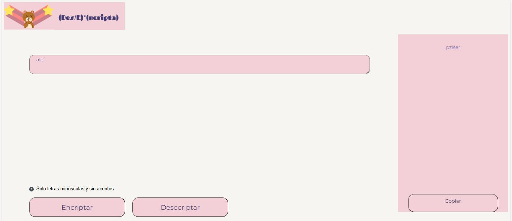
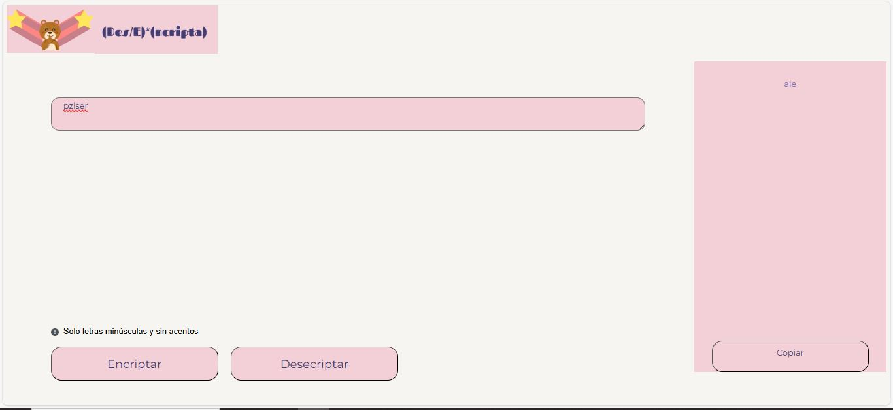
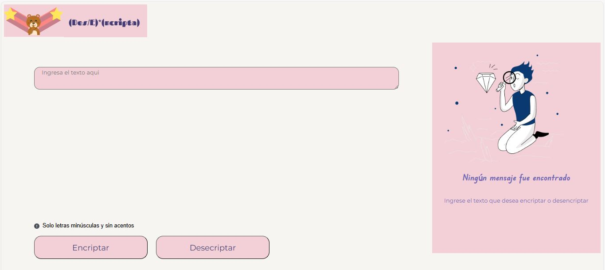

<h1 align="center"> Challenge Encriptador de Texto</h1>

Este es el título que decidí darle a mi proyecto.

*[Descripción del proyecto](#descripción-del-proyecto)

*[Tecnologías utilizadas](#tecnologías-utilizadas)
## 🖥️:Descripción del proyecto

-Este proyecto se realizó con la finalidad de desarrollar un sitio web que nos permitirá cifrar y descifrar textos o palabras. Para ello, se utilizaron ciertas frases que me permitieron mostrar una forma distinta 
y secreta de conocer el verdadero mensaje :speak_no_evil:.

-Lo que realicé fue reemplazar las vocales por las siguientes palabras:
- **a**: por "pz"
- **e**: por "ser"
- **i**: por "aire"
- **o**: por "rm"
- **u**: por "prt"

*Por ejemplo*: Mi nombre es "ale",  así que al ingresar mi nombre y presionar encriptar, me arrojará en el recuadro derecho "pzlser". Como se muestra en la imagen a continuación:

¡Por cierto! El texto que se generó también se puede copiar, así que, si deseas desencriptar ahora ese texto, solo le das clic al botón de copiar y pegas en el recuadro del texto y ya podrás desencriptar el texto cifrado.

## :mega::Tecnologías utilizadas

Este proyecto es totalmente académico, con la finalidad de poner en práctica todos los conocimientos adquiridos en el curso; por lo tanto, se procuró cumplir con los lineamientos y las tecnologías de desarrollo vistas.

Como son:
- **JavaScript**: para crear las funcionalidades.
- **HTML**: para la estrucutra del sitio web.
- **CSS**: para el estilo y diseño de la estrucutra.

 

**Imagén Principal**

